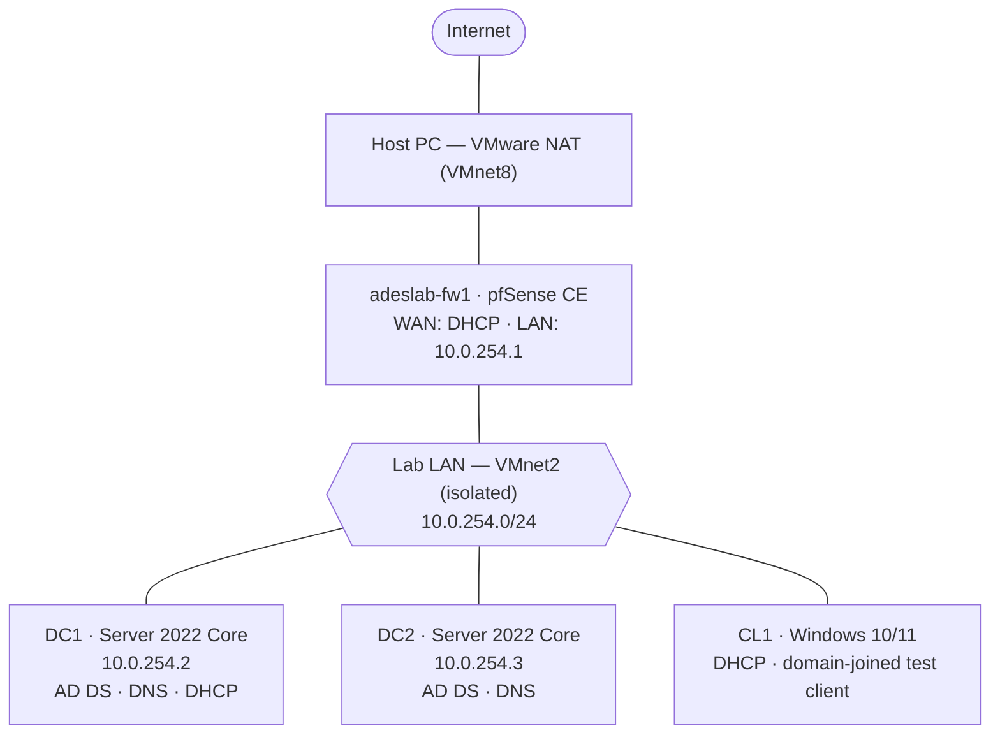

# Active Directory Forest — Part 1: Initial Setup

## Introduction

In this series of write-ups I document the setup and configuration of a medium-sized
corporate domain, `ad.adeslab.com`, from initial domain controller promotion and core
network services through to file sharing, group policy, a forest trust, remote access
VPN, and hybrid identity with Microsoft Entra. The entire lab is built on a single
workstation using VMware Workstation Pro, and is right-sized to run on 16 GB of RAM by
deploying Windows Server roles as Server Core and powering on only the virtual machines
a given stage requires.

I am creating a simple perimeter network with a pfSense firewall for isolation, and to
support a remote access VPN in a later project. Because the focus of this lab is the
configuration of essential IT services rather than network design, I am leaving the
network unsegmented here. Segmentation with a router-on-a-stick topology is covered as a
separate project; adding it to this build would introduce complexity that distracts from
the application-layer services this project is about.

In this first write-up I go through initial forest creation, the promotion of domain
controllers, the creation of the organizational unit structure, and the creation of
users and groups.

## Table of Contents

- [Basic Network Setup](#basic-network-setup)
- [Server Configuration and Forest Creation](#server-configuration-and-forest-creation)
- [Creating Organizational Units, Groups and Users](#creating-organizational-units-groups-and-users)
- [Next Steps](#next-steps)

## Basic Network Setup

This project does not focus on network design or configuration; however, the lab network
does need to be isolated from my home LAN and given a sensible IP addressing scheme. On
Proxmox this isolation would be provided by an Open vSwitch bridge — in VMware Workstation
the equivalent is a custom virtual network. I create a host-only network, `VMnet2`, in
the Virtual Network Editor to act as the lab LAN (`10.0.254.0/24`), disable VMware's
built-in DHCP on it, and leave its host virtual adapter disconnected so that my host PC
has no presence on the lab network. For internet access I use VMware's built-in NAT
network, `VMnet8`, which lets the firewall reach the internet through the host while the
lab stays sealed off behind two layers of NAT.

| Side | VMnet | Type | Settings |
|---|---|---|---|
| WAN | `VMnet8` | NAT (built-in) | pfSense WAN gets an address by DHCP; provides internet via the host |
| LAN | `VMnet2` | Host-only (custom) | Subnet `10.0.254.0/24`; **VMware DHCP disabled**; **no host adapter** (fully isolated) |

The pfSense virtual machine is given two virtual network adapters: its WAN connected to
`VMnet8` (NAT) and its LAN connected to `VMnet2` (the isolated lab network). I give it
one virtual CPU, 1 GB of RAM and 20 GB of storage — for a lab that does not produce much
outbound traffic, this sizing is more than enough.

After running through the pfSense installation I assign the interfaces at the console:
WAN to the NAT adapter, which receives an address automatically, and LAN set to
`10.0.254.1` with a /24 mask. Because the lab LAN is fully isolated and the domain
controllers run Server Core with no browser, the pfSense web configurator is reached from
a virtual machine on the lab network rather than from the host. On the first page of the
configuration wizard I give the firewall a hostname of `adeslab-fw1` and a domain of
`adeslab.internal`, keeping the firewall's namespace separate from the Active Directory
domain since the firewall is not domain-joined. The primary DNS server is set temporarily
to Cloudflare's `1.1.1.1`, to be changed once the domain controllers are online.

I accept the defaults on the WAN interface, including the rules that block RFC 1918 and
bogon networks, and set the LAN interface to `10.0.254.1/24`. I chose `10.0.254.0/24`
deliberately: a remote access VPN is added in a later project, and using the very common
`192.168.1.0/24` home-router network would cause IP conflicts for remote users connecting
in. Out of the box pfSense performs NAT and allows all outbound traffic, so no firewall
rules are required at this stage. I also switch the DNS resolver from resolver mode to
forward mode, which avoids DNSSEC-related name resolution failures by forwarding queries
to the configured upstream server.



| VM | OS | Role | vCPU | RAM | Disk (on D:) | IP |
|---|---|---|---|---|---|---|
| `adeslab-fw1` | pfSense CE 2.7 | Firewall / NAT | 1 | 1 GB | 20 GB | WAN DHCP / LAN 10.0.254.1 |
| `DC1` | Server 2022 Core | Primary DC, DNS, DHCP | 2 | 2.5 GB | 40 GB | 10.0.254.2 |
| `DC2` | Server 2022 Core | Secondary DC, DNS | 2 | 2 GB | 40 GB | 10.0.254.3 |
| `CL1` | Windows 10/11 | Test client (optional) | 2 | 2 GB | 40 GB | DHCP |

**IP addressing — `10.0.254.0/24`:**

| Host | Interface | IP | Assignment |
|---|---|---|---|
| `adeslab-fw1` | WAN | `192.168.x.x` | DHCP from VMnet8 |
| `adeslab-fw1` | LAN | `10.0.254.1` | static — default gateway |
| `DC1` | LAN | `10.0.254.2` | static |
| `DC2` | LAN | `10.0.254.3` | static |
| `CL1` | LAN | `10.0.254.100`+ | DHCP (from DC1) |

Reserved ranges: `.1–.10` infrastructure (static), `.100–.200` DHCP pool, `.201–.254`
reserved for future use (e.g. a VPN client pool).

**DHCP and DNS:**

- **DHCP** runs on **DC1** (Windows DHCP role), serving the `.100–.200` pool and
  advertising both DCs as DNS servers and `10.0.254.1` as the gateway. pfSense's own
  DHCP server stays disabled.
- **DCs** point their DNS at each other first, then themselves (DC1 → `10.0.254.3`,
  then `127.0.0.1`; DC2 → `10.0.254.2`, then `127.0.0.1`) to avoid DNS islanding.
- **Clients** resolve via the DCs, never via pfSense. pfSense uses an upstream resolver
  for its own traffic and performs NAT for all outbound lab connections.

## Server Configuration and Forest Creation

1. Build `DC1` (Server 2022 Core), set a static IP of `10.0.254.2`, and rename the host.
2. Install the AD DS role and promote `DC1` to a new forest, `ad.adeslab.com`.
3. Build `DC2` (Server 2022 Core), set `10.0.254.3`, join the domain, and promote it as
   a secondary domain controller and DNS server for redundancy.
4. Configure DHCP on `DC1` to serve the `10.0.254.0/24` range and advertise both DCs as
   DNS servers.

## Creating Organizational Units, Groups and Users

The forest uses the following organizational-unit structure:

```
ad.adeslab.com/
├── IT/
│   ├── Users/
│   │   └── Privileged Accounts/
│   └── Computers/
└── Employees/
    ├── Sales/        (Users/, Computers/)
    ├── Marketing/    (Users/, Computers/)
    ├── Finance/      (Users/, Computers/)
    ├── HR/           (Users/, Computers/)
    └── Engineering/  (Users/, Computers/)
```

Department security groups (global scope) are created for each department, along with IT
support groups. IT staff follow a privileged-account model: a standard daily-use account
plus a separate privileged account (`first.last.p`) used only for administrative tasks —
never interactive logon, no Microsoft 365 licensing. Employee accounts are bulk-created
from `data/users.csv` and placed in the correct OUs with department group membership.

## Next Steps

With the forest established, the next project builds a second forest (`corp.cyrlab.com`)
and configures an Active Directory forest trust between the two.
