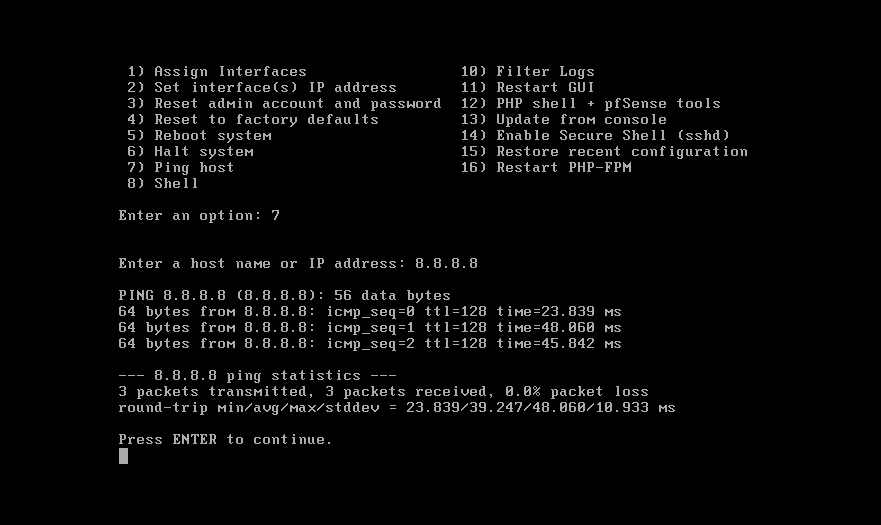
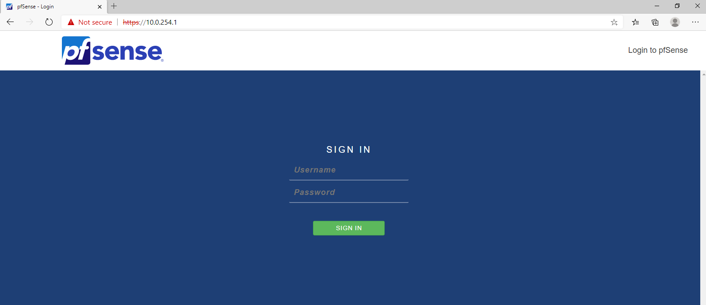

# Small-Medium Business Active Directory Infrastructure — Part 1: Initial Setup

## Introduction

In this series of write-ups I document the setup and configuration of a medium-sized
corporate domain, `ad.adeslab.com`, from initial DC promotion, configuring the network services, file sharing, group policy for basic security and standardization, to the creation of an hybrid identity with Microsoft Entra, remote access VPN, and backup and recovery of critical services and resources.


I created a  simple perimeter network with a pfSense firewall for isolation, and to
support a remote access VPN in a later  lab project. The main focus of this lab is the
configuration of essential IT services , therefore i will be leaving the network unsegmented. 

In this first write-up I go through initial forest creation, the promotion of domain
controllers, the creation of the organizational unit structure, and the creation of
users and groups. Most of these tasks will be done with scripts i have pre-written.

## Table of Contents

- [Basic Network Setup](#basic-network-setup)
- [Server Configuration and Forest Creation](#server-configuration-and-forest-creation)
- [Creating Organizational Units, Groups and Users](#creating-organizational-units-groups-and-users)
- [Next Steps](#next-steps)

## Basic Network Setup

This project does not focus on network design or configuration; however, the lab network
does need to be isolated from my home LAN and given a sensible IP addressing scheme. This is achieved in VMware Workstation
by creating a custom virtual network. I created a host-only network, `VMnet2`, in
the Virtual Network Editor to act as the lab LAN (`10.0.254.0/24`). I also disabled VMware's
built-in DHCP on it, and left its host virtual adapter disconnected so that my host PC
has no presence on the lab network. 

PfSense firewall receives its WAN IP from VMware's NAT DHCP (acting as a client), and then serves its own DHCP on the LAN — which is why VMware's DHCP is left on for the NAT network but disabled on the lab LAN."

For internet access I use VMware's built-in NAT
network, `VMnet8`, which lets the firewall reach the internet through the host, sealing off the lab behind two layers of NAT. 

I gave the Pfsense virtual machine two virtual network adapters: its WAN connected to
`VMnet8` (NAT) and its LAN connected to `VMnet2` (the isolated lab network). I then gave it
two virtual CPUs, 1 GB of RAM and 20 GB of storage - for a lab environment that does not produce much
outbound traffic, this sizing works well. I then completed the Installation of the Pfsense firewall and tested it has outbound internet access.



After running through the pfSense installation I assigned the interfaces at the console:
WAN to the NAT adapter, which receives an address automatically, and LAN set to
`10.0.254.1` with a /24 mask. Because the lab LAN is fully isolated, the pfSense web
configurator is reached from `DC1` — rather than from the host. 




On the first page of the
configuration wizard I give the firewall a hostname of `adeslab-fw1` and a domain of
`adeslab.internal`, keeping the firewall's namespace separate from the Active Directory
domain since the firewall will not be domain-joined. The DNS servers are set temporarily to
Cloudflare's `1.1.1.1` and Google's `8.8.8.8`, to be changed once the primary and secondary domain controllers
are online.


I accept the defaults on the WAN interface, including the rules that block RFC 1918 and
bogon networks, and set the LAN interface to `10.0.254.1/24`. I chose `10.0.254.0/24`
deliberately: a remote access VPN is added in a later project, and using the very common
`192.168.1.0/24` home-router network would cause IP conflicts for remote users connecting
in. Out of the box pfSense performs NAT and allows all outbound traffic, so no firewall
rules are required at this stage. I also switch the DNS resolver from resolver mode to
forward mode, which avoids DNSSEC-related name resolution failures by forwarding queries
to the configured upstream servers.

| VM | OS | Role | vCPU | RAM | Disk (on D:) | IP |
|---|---|---|---|---|---|---|
| `adeslab-fw1` | pfSense CE 2.7.2 | Firewall / NAT / DHCP | 2 | 1 GB | 20 GB | WAN DHCP / LAN 10.0.254.1 |
| `DC1` | Server 2022 Datacenter (Desktop Experience) | Primary DC, DNS | 4 | 4 GB | 40 GB | 10.0.254.10 |
| `DC2` | Server 2022 Datacenter Core | Secondary DC, DNS | 4 | 3 GB | 100 GB | 10.0.254.11 |

> The only adaptations from the reference lab are the hypervisor (VMware Workstation
> instead of Proxmox) and the per-VM **RAM**, scaled to fit a 16 GB host (Mike uses
> 8 GB per DC on a 128 GB machine). vCPU counts, disk sizes, OS editions, roles, domain
> design and IP plan are identical.

**IP addressing — `10.0.254.0/24`:**

The firewall's WAN sits on `VMnet8` and pulls a `192.168.170.x` address from VMware's NAT
DHCP. On the lab LAN, addresses are allocated by purpose:

| Range | Assignment | Purpose |
|---|---|---|
| `10.0.254.1` | Default gateway | pfSense firewall (`adeslab-fw1`) |
| `10.0.254.10` | `DC1` | Primary DC — AD DS, DNS |
| `10.0.254.11` | `DC2` | Secondary DC — AD DS, DNS |
| `10.0.254.20–29` | Core infrastructure servers | static (e.g. SQL, file/print) |
| `10.0.254.30–49` | Application / member servers | static |
| `10.0.254.50–200` | DHCP client scope | dynamic — Windows 10/11 clients |
| `10.0.254.201–254` | Management / networking | reserved |

**DHCP and DNS:**

- **DHCP** runs on **pfSense** (`adeslab-fw1`), serving the `.50–.200` client scope. Once
  the DCs are online, the DHCP **DNS option** is set to advertise `10.0.254.10` / `.11`,
  with `10.0.254.1` as the gateway.
- **DCs** point their DNS at each other first, then themselves (DC1 → `10.0.254.11`,
  then `127.0.0.1`; DC2 → `10.0.254.10`, then `127.0.0.1`) to avoid DNS islanding.
- **Domain members** (joined in later projects) will resolve via the DCs, never via
  pfSense. The DHCP role and pool are configured now so that future clients receive the
  correct DNS and gateway automatically. pfSense uses an upstream resolver for its own
  traffic and performs NAT for all outbound lab connections.

**Connectivity and management**

Outbound traffic from the lab reaches the internet through two layers of NAT. A lab
machine on `VMnet2` (for example DC1) uses pfSense's LAN address `10.0.254.1` as its
default gateway. pfSense routes that traffic out of its WAN interface (`em0`), which
holds a `192.168.170.x` address leased by VMware's NAT service on `VMnet8`; VMware then
NATs it again through the host's physical adapter to the home router and out to the
internet:

```
DC1 (10.0.254.x)
  → pfSense LAN (10.0.254.1)        # default gateway
  → pfSense WAN (em0, 192.168.170.x) # NAT/route
  → VMware NAT (VMnet8)              # second NAT
  → host physical NIC → home router → Internet
```

Outbound connectivity is confirmed by pinging a public address (`8.8.8.8`) from the
firewall, which replies with no packet loss.

Because the lab LAN deliberately has no host adapter, the pfSense web configurator at
`https://10.0.254.1` is **not** reachable from the host directly. It is managed from a
virtual machine on the lab LAN — DC1 — which receives its address from pfSense's DHCP and
reaches the firewall GUI over the same isolated `VMnet2` switch. This is the on-host
equivalent of administering the firewall from the first domain controller, as in the
reference lab.

## Server Configuration and Forest Creation

1. On `DC1` (Server 2022 Desktop Experience), set a static IP of `10.0.254.10/24`,
   gateway `10.0.254.1`, and DNS `127.0.0.1` (it will be its own DNS server); rename the
   host to `DC1` and reboot.
2. Promote `DC1` to the first domain controller of a new forest, `ad.adeslab.com`. The
   deployment is captured as a script —
   [`scripts/AdeslabADDSDeployment-DC1.ps1`](scripts/AdeslabADDSDeployment-DC1.ps1) —
   which is **pulled onto the DC from this repository and run**, installing the AD DS role
   and creating the forest with an integrated DNS server. The script prompts for the DSRM
   (Safe Mode) password and reboots on completion:

   ```powershell
   # Temporarily resolve via pfSense so the script can be fetched from GitHub
   Set-DnsClientServerAddress -InterfaceAlias "Ethernet0" -ServerAddresses 10.0.254.1

   # Download the forest-deployment script from this repository
   $url = "https://raw.githubusercontent.com/CadesCloudSolutions/HomeLab/main/projects/smb-active-directory-infrastructure-pt-1/scripts/AdeslabADDSDeployment-DC1.ps1"
   New-Item -ItemType Directory -Path C:\Scripts -Force | Out-Null
   Invoke-WebRequest -Uri $url -OutFile C:\Scripts\AdeslabADDSDeployment-DC1.ps1 -UseBasicParsing

   # Unblock and run (prompts for the DSRM password, then reboots)
   Unblock-File C:\Scripts\AdeslabADDSDeployment-DC1.ps1
   & C:\Scripts\AdeslabADDSDeployment-DC1.ps1
   ```

3. After the reboot, log in as `AD\Administrator` and set DC1's **DNS forwarders** to
   pfSense (`10.0.254.1`) so external names resolve through the firewall.
4. Build `DC2` (Server 2022 Core), set `10.0.254.11`, join the domain, and promote it as
   a secondary domain controller and DNS server (`Install-ADDSDomainController`) for
   redundancy.
5. On pfSense, set the DHCP scope's DNS option to advertise both DCs (`10.0.254.10` /
   `.11`) now that they are online.

## Creating Organizational Units, Groups and Users

The forest uses the following organizational-unit structure:

```
ad.adeslab.com/
├── IT/
│   ├── Users/
│   │   └── Privileged Accounts/
│   └── Computers/
└── Employees/
    ├── Sales/        (Users/, Computers/)
    ├── Marketing/    (Users/, Computers/)
    ├── Finance/      (Users/, Computers/)
    ├── HR/           (Users/, Computers/)
    └── Engineering/  (Users/, Computers/)
```

Department security groups (global scope) are created for each department, along with IT
support groups. IT staff follow a privileged-account model: a standard daily-use account
plus a separate privileged account (`first.last.p`) used only for administrative tasks —
never interactive logon, no Microsoft 365 licensing. Employee accounts are bulk-created
from `data/users.csv` and placed in the correct OUs with department group membership.

## Next Steps

With the forest established, the next project configures hybrid identity by installing
Microsoft Entra Connect Sync on a dedicated member server, adding a routable UPN suffix,
and synchronising users and groups to Microsoft Entra ID using Password Hash Sync.
